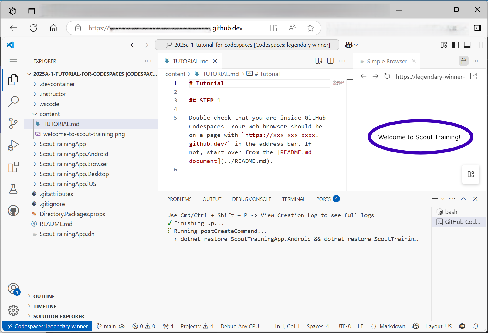

# README

This tutorial is meant to be led by an instructor with learners who participate with web browsers.
This tutorial should be ideal for students who may be using school-provided, tightly-controlled laptops.

This tutorial uses remote workstations provided by **GitHub Codespaces**. There is a free tier, but students get it for free with the [GitHub Student Developer Pack](https://education.github.com/pack).

Before the class or YouTube video starts, click the following since it will take **10 minutes** for your workstation to be ready:

You are ready when you see a webpage in your remote workspace editor that says **Welcome to Scout Training**:

---

Are you currently in a training session? You need to start in the first [content/TUTORIAL.md](content/TUTORIAL.md).

---

If you like this content, please add a star to [this tutorial's GitHub repository](https://github.com/diskuv/2025a-1-tutorial-for-codespaces) and the related [dkcoder GitHub repository](https://github.com/diskuv/dkcoder).

Add a [feature request here](https://github.com/diskuv/2025a-1-tutorial-for-codespaces/issues) if you'd like to ask for a second tutorial for the same content on a local PC.
